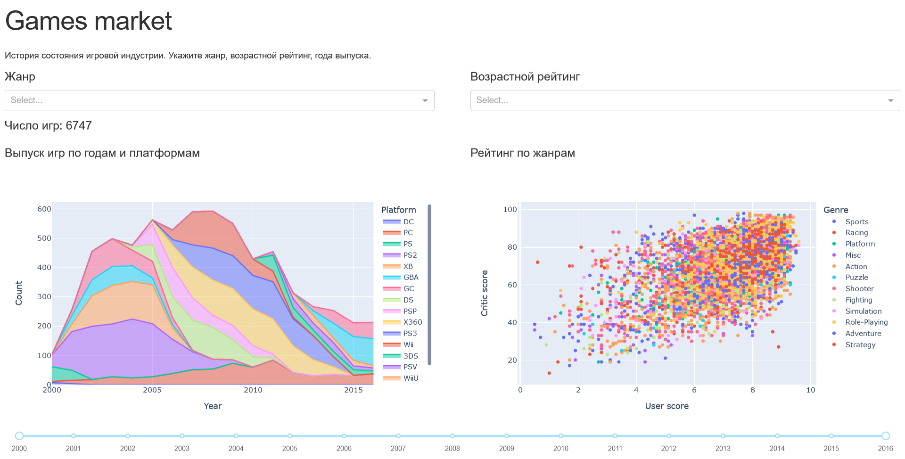

# Games Market Dash

Дана таблица истории состояния игровой индустрии [ games.csv](./games.csv). Описание полей:

*   Name - название проекта;
*   Platform - платформа;
*   Year_of_Release - год выпуска;
*   Genre - жанр игры;
*   Critic_Score - оценка критиков;
*   User_Score - оценка игроков;
*   Rating - возрастной рейтинг.

Из данных нужно исключить проекты ранее 2000 года и проекты, для которых имеются пропуски данных в любой из колонок. Используя dash (plotly), постройте дашборд по этому макету:

| Наименование дашборда                                        |                                                              |
| ------------------------------------------------------------ | ------------------------------------------------------------ |
| Описание дашборда (назначение, краткая инструкция по использованию) |                                                              |
| **Фильтр 1**: Фильтр жанров (множественный выбор)            | **Фильтр 2**: Фильтр рейтингов (множественный выбор)         |
| **Интерактивный текст 1**: Количество выбранных игр (результат фильтрации) |                                                              |
| **График 1**: Stacked area plot, показывающий выпуск игр по годам и платформам. | **График 2**: Scatter plot с разбивкой по жанрам (каждому жанру соответствует один цвет). По оси X - оценки игроков, по оси Y - оценки критиков. |
| **Фильтр 3**: Интервал годов выпуска                         |                                                              |

Интерактивный текст 1, График 1 и График 2 должны реагировать на изменения значений всех трех фильтров одновременно.

Результат должен представлять собой py-файл, написанный на python3.

Файл с данными должен читаться из той же папки, где находится файл дашборда.

https://games-market-dash.herokuapp.com/

